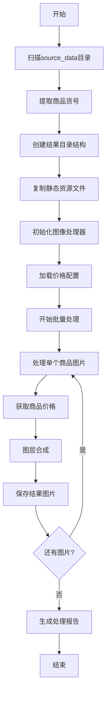

# 商品图片批量处理工具

一个专业的商品图片批量处理系统，基于Python开发，用于自动化生成带有价格标签的商品宣传图片。

## 🎯 项目概述

商品图片批量处理程序，专为电商和零售业务设计。通过配置化的图层合成技术，能够自动为商品图片添加背景、价格标签等元素，大幅提升商品图片制作效率。

### 核心特性

- **📋 配置驱动**: 基于YAML配置文件的灵活图层管理
- **💰 价格管理**: 智能的商品价格匹配和格式化系统  
- **🖼️ 图层合成**: 支持多图层叠加、文字渲染和透明度处理
- **⚡ 批量处理**: 高效的批量商品图片处理能力
- **📁 智能管理**: 自动化的文件夹结构创建和资源复制
- **🔧 变量替换**: 动态内容替换，支持模板化配置
- **📊 详细日志**: 完整的处理日志和统计报告

## 🏗️ 项目架构

```
pythonps/
├── main.py                    # 程序入口文件
├── config.yaml               # 主配置文件（图层配置）
├── prices.yaml               # 商品价格配置文件
├── requirements.txt          # Python依赖包
├── utils/                    # 核心工具模块
│   ├── __init__.py          # 模块初始化
│   ├── file_manager.py      # 文件管理器
│   ├── image_processor.py   # 图像处理器
│   ├── price_manager.py     # 价格管理器
│   └── logger.py           # 日志系统
├── source_data/             # 商品原图存放目录
├── result_data/             # 处理结果输出目录
│   └── [货号]/             # 按货号分类的结果文件夹
├── static/                  # 静态资源文件
│   ├── bg.png              # 背景图层
│   ├── detail1.jpg         # 尺码表
│   ├── detail2.jpg         # 购物指南
│   └── detail3.jpg         # 洗涤说明
└── logs/                    # 日志文件目录
```

## 🚀 快速开始

### 环境要求

- Python 3.7+
- Windows 10/11（推荐）或其他操作系统

### 1. 安装依赖

```bash
pip install -r requirements.txt
```

### 2. 准备商品图片

将商品原图放入 `source_data/` 目录，文件名格式为：`{货号}.{扩展名}`

例如：
```
source_data/
├── A18453.jpg
├── D253.png
└── P51.jpg
```

### 3. 配置商品价格

编辑 `prices.yaml` 文件，添加商品价格信息：

```yaml
prices:
  "A18453": "89.9"
  "D253": "89.9"
  "P51": "89.9"
```

### 4. 运行程序

```bash
python main.py
```

## ⚙️ 配置详解

### 图层配置 (config.yaml)

#### 基础设置
```yaml
# 画布尺寸
canvas_size: [1000, 1000]

# 背景颜色 RGBA  
background_color: [255, 255, 255, 255]

# 输出图片质量
quality: 85
```

#### 图层定义
```yaml
picture_layers:
  # 商品主图层
  layer_1:
    source: "${product_image}"     # 动态商品图片路径
    description: "商品主图"
    width: 1000
    height: 1000
    x: 0
    y: 0
    
  # 背景图层  
  layer_2:
    source: "static/bg.png"       # 固定背景图片
    description: "背景图"
    width: 1000
    height: 1000
    x: 0
    y: 0
    
  # 价格文字层
  layer_3:
    type: "text"
    text: "${price_text}"         # 动态价格文字
    description: "右下角价格"
    font_size: 80
    font_color: [255, 255, 255, 255]  # 白色文字
    x: 710                        # 绝对坐标定位
    y: 760
```

#### 资源文件配置
```yaml
copy_files:
  - source: "static/detail1.jpg"
    description: "尺码表"
  - source: "static/detail2.jpg"  
    description: "购物指南"
  - source: "static/detail3.jpg"
    description: "洗涤说明"
```

### 价格配置 (prices.yaml)

#### 价格格式设置
```yaml
price_config:
  # 价格显示格式
  default_format: "{price}"
  
  # 默认价格（未找到时使用）
  default_price: "99.00"
  
  # 显示配置
  display_settings:
    show_currency: false      # 是否显示货币符号
    currency_symbol: "¥"      # 货币符号
    decimal_places: 1         # 小数位数
```

#### 商品价格列表
```yaml
prices:
  "A18453": "89.9"
  "D253": "89.9"
  "A18452": "79.9"
  # ... 更多商品价格
```

## 🔧 核心模块说明

### 1. 文件管理器 (FileManager)

负责项目的文件操作和目录管理：

- **图片文件发现**: 自动扫描source_data目录中的图片文件
- **货号提取**: 从文件名中提取商品货号
- **目录创建**: 按货号创建结果文件夹结构
- **资源复制**: 自动复制配置文件中指定的静态资源

**核心方法**:
```python
file_manager = FileManager()
image_files = file_manager.get_all_image_files()
product_codes = file_manager.extract_product_codes()
result = file_manager.process_all()
```

### 2. 图像处理器 (ImageProcessor)

核心的图像合成引擎：

- **多图层合成**: 支持图片图层和文字图层的叠加
- **变量替换**: 动态替换配置中的变量内容
- **字体管理**: 自动检测和加载系统字体
- **格式支持**: 支持PNG、JPEG、BMP等多种图片格式

**核心方法**:
```python
processor = ImageProcessor("config.yaml")
processor.update_source_data({"product_image": "path/to/image.jpg"})
success = processor.create_composite_image("output/result.png")
```

### 3. 价格管理器 (PriceManager)

智能的商品价格管理系统：

- **价格查询**: 根据货号查询对应价格
- **格式化**: 自动格式化价格显示
- **统计分析**: 提供价格统计信息
- **默认处理**: 未找到价格时使用默认值

**核心方法**:
```python
price_manager = PriceManager("prices.yaml")
price_text = price_manager.get_price("A18453")
stats = price_manager.get_price_statistics()
```

### 4. 日志系统 (Logger)

完善的日志记录系统：

- **多级别日志**: 支持DEBUG、INFO、WARNING、ERROR等级别
- **双重输出**: 同时输出到控制台和文件
- **彩色显示**: 控制台日志支持颜色区分
- **文件轮转**: 自动管理日志文件大小和数量

## 💡 使用场景

### 场景1: 电商商品图制作

批量为电商平台商品生成统一格式的宣传图片：

1. 准备商品原图和价格信息
2. 配置品牌背景和价格样式
3. 一键批量生成带价格标签的商品图

### 场景2: 促销活动图片

快速制作促销活动的商品展示图：

1. 更新价格配置中的促销价格
2. 修改背景图为促销背景
3. 批量生成促销商品图片

### 场景3: 多平台适配

为不同销售平台生成相应规格的商品图：

1. 配置不同的画布尺寸
2. 调整图层位置和文字大小
3. 生成符合平台要求的图片

## 📊 处理流程



## 🎨 文字定位系统

支持两种文字定位方式：

### 1. 绝对坐标定位
```yaml
layer_3:
  type: "text"
  text: "${price_text}"
  x: 710          # 精确X坐标
  y: 760          # 精确Y坐标
```

### 2. 相对位置定位  
```yaml
layer_3:
  type: "text"
  text: "${price_text}"
  position: "bottom_right"  # 预设位置
  margin_x: 50             # X轴边距
  margin_y: 50             # Y轴边距
```

**支持的预设位置**:
- `top_left`, `top_center`, `top_right`
- `center_left`, `center`, `center_right`  
- `bottom_left`, `bottom_center`, `bottom_right`

## 🔍 系统字体支持

程序会自动检测并使用系统字体：

- **Windows**: 微软雅黑 (msyh.ttc)、宋体 (simsun.ttc)
- **macOS**: Arial
- **Linux**: DejaVu Sans
- **备用**: PIL默认字体

## 📈 性能特性

- **内存优化**: 按需加载图片，避免内存溢出
- **批量处理**: 支持大量商品图片的高效处理
- **错误恢复**: 单个文件处理失败不影响整体进程
- **进度显示**: 实时显示处理进度和统计信息

## 🛠️ 依赖项

- **Pillow (>=11.2.1)**: 图像处理核心库
- **PyYAML (>=6.0)**: YAML配置文件解析
- **tqdm (>=4.64.0)**: 进度条显示

## ⚠️ 注意事项

1. **文件命名**: 商品图片文件名必须为货号（不含扩展名）
2. **图片格式**: 支持JPG、PNG、BMP等常见格式
3. **路径配置**: 确保配置文件中的静态资源路径正确
4. **字体渲染**: 中文字体在不同系统上可能有差异
5. **内存使用**: 处理大尺寸图片时注意内存占用
